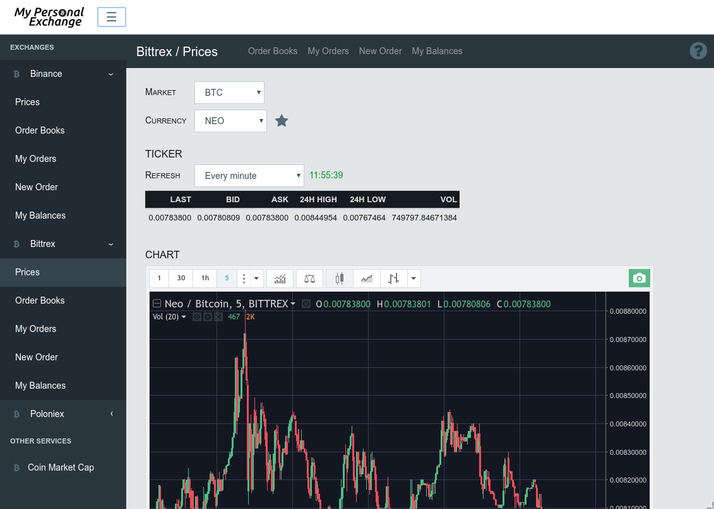

# crypto-exchanges-gateway

Your gateway to the world of crypto !

## Disclaimer

This project cannot be considered in any way as trading advice.

Use it at your own risks and be careful with your money ;)

## What it does

* Provides a unified REST API to various exchanges (can be used to automate trading or build bots)
* Handles authentication so that on client side you can concentrate on what really matters
* Implements rate limiting when forwarding requests to remote exchanges
* Provides a REST API to send push notifications using [PushOver](https://pushover.net/api)
* Provides a basic UI which implements most API calls (see [documentation in _doc_ directory](doc/ui/index.adoc))



## How to use it

[Install](#installation) it wherever you want and start sending requests from your own program

* it can be hosted on a VM in the cloud
* it can be installed at home, on a [Raspberry Pi](https://www.raspberrypi.org/products/raspberry-pi-zero-w/)

Just use you favorite language (_python_, _javascript_, _ruby_, _bash_, ...) to send request to the gateway. Your own service, your own rules !

## Available Exchanges

Currently supports for following exchanges :

* [Bittrex](https://www.bittrex.com/) (my favorite)
* [Binance](https://www.binance.com/) (nice Chinese exchange with good support)
* [Poloniex](https://www.poloniex.com) ([**worst support**](https://www.reddit.com/r/PoloniexForum/) ever)
* More to come...

Following API are currently supported :

* Retrieve pairs
* Retrieve tickers
* Retrieve order book
* Retrieve last executed trades
* List open orders
* List closed orders
* Retrieve balances

See [documentation in _doc_ directory](doc/exchanges/index.adoc) for an overview of each API

## Limitations

Margin trading is not supported (and is unlikely to be)

## Other services

Currently supports following services :

* [CoinMarket](https://coinmarketcap.com/) (see [documentation in _doc_ directory](doc/coinmarketcap/index.adoc) for an overview of each API)
* [PushOver](https://pushover.net/) (see [documentation in _doc_ directory](doc/pushover/index.adoc) for an overview of each API)

## Rate limiting

Rate limiting is implemented when required by exchange thanks to [Bottleneck](https://www.npmjs.com/package/bottleneck)

## Installation

* Install dependencies

```
npm install
```

* Copy sample config

```
cp config/config.sample.json config/config.json
```

Check [documentation in _doc_ directory](doc/config.adoc) for detailed information on each config section

* Start gateway

```
node gateway.js
```

* Check which exchanges are enabled

Open http://127.0.0.1:8000/exchanges/ in your browser. You should see JSON content such as below :

```javascript
["binance","bittrex","poloniex"]
```

By default, only public API will be enabled. In order to access trading/private API, you need to update _config.json_ with appropriate _user_ and _secret_ provided by exchange (check [documentation in _doc_ directory](doc/config.adoc) )

* Check BTC & ETH prices on CoinMarketCap

Open http://127.0.0.1:8000/coinmarketcap/tickers?symbols=BTC,ETH in your browser. You should see JSON content such as below :

```javascript
[
    {
        "name":"Bitcoin",
        "symbol":"BTC",
        "rank":1,
        "last_updated":1505472872,
        "convert_currency":null,
        "price_converted":null,
        "24h_volume_converted":null,
        "market_cap_converted":null,
        "price_usd":2991.55,
        "price_btc":1,
        "24h_volume_usd":3303620000,
        "market_cap_usd":49561792636,
        "available_supply":16567262,
        "total_supply":16567262,
        "percent_change_1h":-0.99,
        "percent_change_24h":-18.73,
        "percent_change_7d":-34.09
    },
    {
        "name":"Ethereum",
        "symbol":"ETH",
        "rank":2,
        "last_updated":1505472866,
        "convert_currency":null,
        "price_converted":null,
        "24h_volume_converted":null,
        "market_cap_converted":null,
        "price_usd":199.814,
        "price_btc":0.0660232,
        "24h_volume_usd":1490080000,
        "market_cap_usd":18908734638,
        "available_supply":94631681,
        "total_supply":94631681,
        "percent_change_1h":-3.49,
        "percent_change_24h":-21.93,
        "percent_change_7d":-37.43
    }
]
```

* Place an order to buy 1 NEO at 0.0040BTC on Bittrex (assuming you have enough funds)

Execute the following in a terminal :

```
curl -X POST 'http://127.0.0.1:8000/exchanges/bittrex/openOrders?pair=BTC-NEO&quantity=1&targetRate=0.0040'
```

You should see JSON content such as below :

```javascript
{"orderNumber":"8bc49a59-1056-4c20-90f2-893fff2be279"}
```

* Cancel above order (assuming order still exists)

Execute the following in a terminal :

```
curl -X DELETE 'http://127.0.0.1:8000/exchanges/bittrex/openOrders/8bc49a59-1056-4c20-90f2-893fff2be279'
```

You should see JSON content such as below in case order is valid :

```javascript
{}
```

## Docker

A docker image is available at https://hub.docker.com/r/apendergast/crypto-exchanges-gateway/

* Pull image

```
docker pull apendergast/crypto-exchanges-gateway
```

* Run image

```
docker run --rm -p 8000:8000 --name ceg apendergast/crypto-exchanges-gateway
```

You should then be able to access service on http://127.0.0.1:8000

* Check which exchanges are enabled

Open http://127.0.0.1:8000/exchanges/ in your browser. You should see JSON content such as below :

```javascript
["binance","bittrex","poloniex"]
```

By default, only public API will be enabled. In order to access trading/private API, you need to pass environment when creating container. Following environment variables are available :

* cfg.logLevel : log level
* cfg.ui.enabled : enable/disable UI (value should be set to _1_ to enable UI, _0_ to disable UI)
* cfg.pushover.user : PushOver user key
* cfg.pushover.token : PushOver token
* cfg.exchanges.poloniex.key : Poloniex user key
* cfg.exchanges.poloniex.secret : Poloniex secret
* cfg.exchanges.bittrex.key : Bittrex user key
* cfg.exchanges.bittrex.secret : Bittrex secret
* cfg.exchanges.binance.key : Binance user key
* cfg.exchanges.binance.secret : Binance secret

_Examples_ :

Run container with Bittrex user/key environment variables

```
docker run --rm -p 8000:8000 --name ceg -e cfg.exchanges.bittrex.key='abcdefghijkl' -e cfg.exchanges.bittrex.secret='123456789' apendergast/crypto-exchanges-gateway
```

## Dependencies

This project was made possible thanks to following projects :

* [express](https://www.npmjs.com/package/express)
* [body-parser](https://www.npmjs.com/package/body-parser)
* [lodash](https://www.npmjs.com/package/lodash)
* [node.bittrex.api](https://www.npmjs.com/package/node.bittrex.api)
* [binance](https://github.com/aloysius-pgast/binance)
* [poloniex-api-node](https://www.npmjs.com/package/poloniex-api-node)
* [bottleneck](https://www.npmjs.com/package/bottleneck) (for rate limiting)
* [winston](https://www.npmjs.com/package/winston) (for logging)
* [chump](https://www.npmjs.com/package/chump) (for PushOver)
* [uuid](https://www.npmjs.com/package/uuid)

## Donate

This project is a work in progress. If you find it useful, you might consider a little donation ;)

BTC: `163Bu8qMSDoHc1sCatcnyZcpm38Z6PWf6E`

ETH: `0xDEBBEEB9624449D7f2c87497F21722b1731D42a8`

NEO/GAS: `AaQ5xJt4v8GunVchTJXur8WtM8ksprnxRZ`
