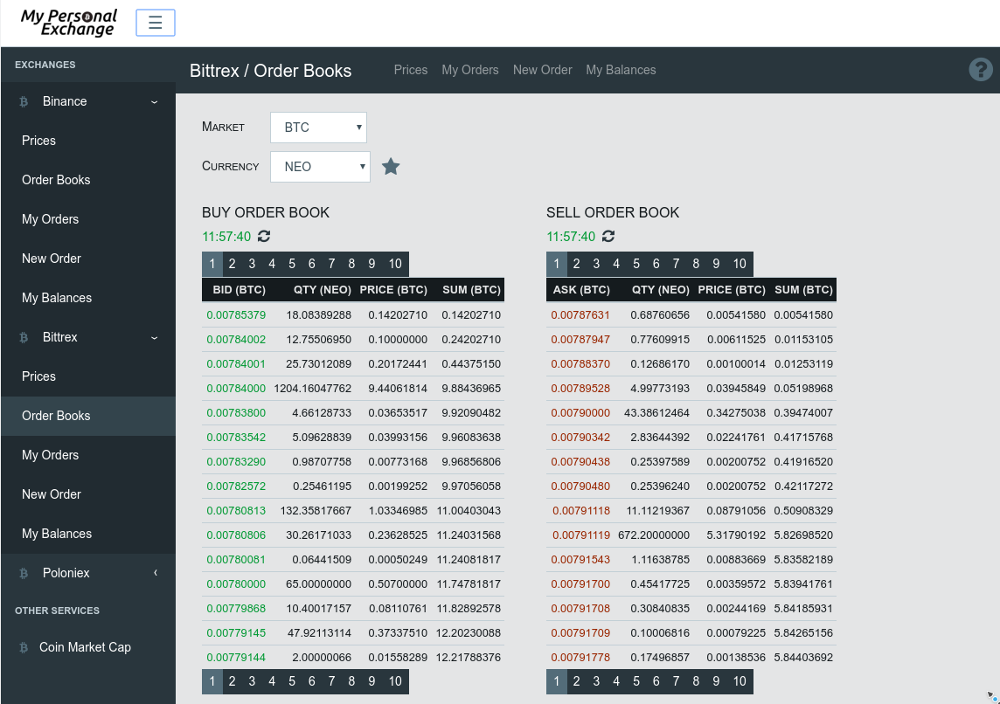
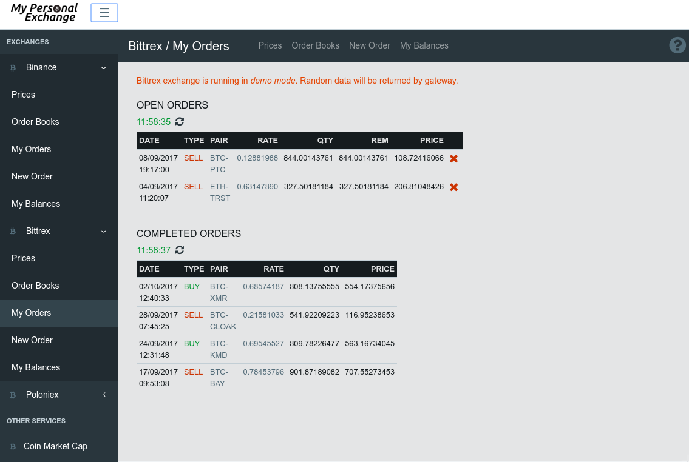
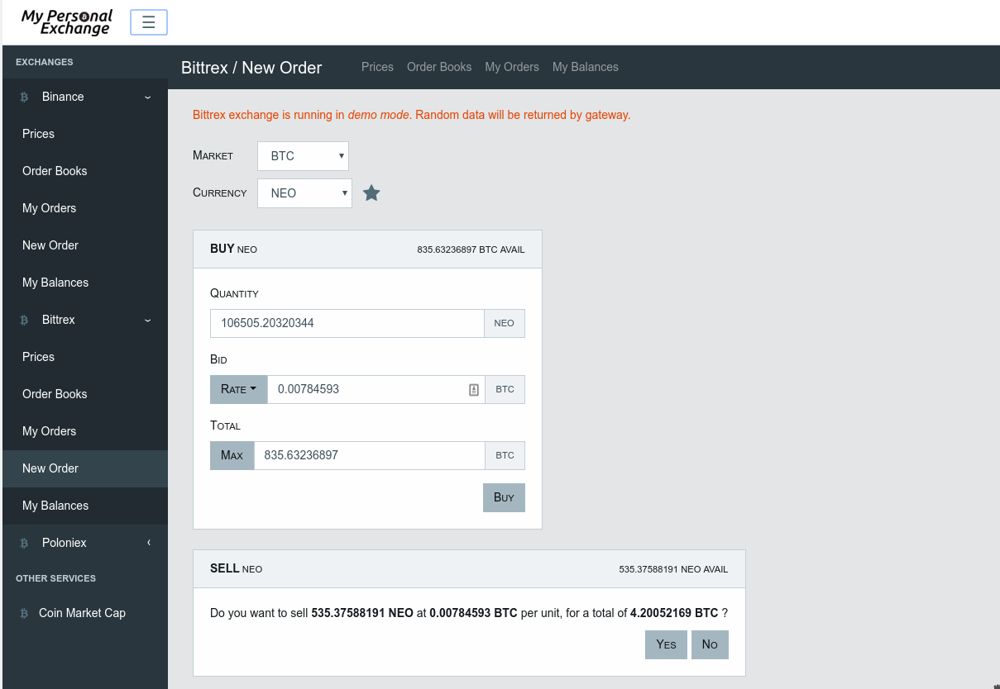
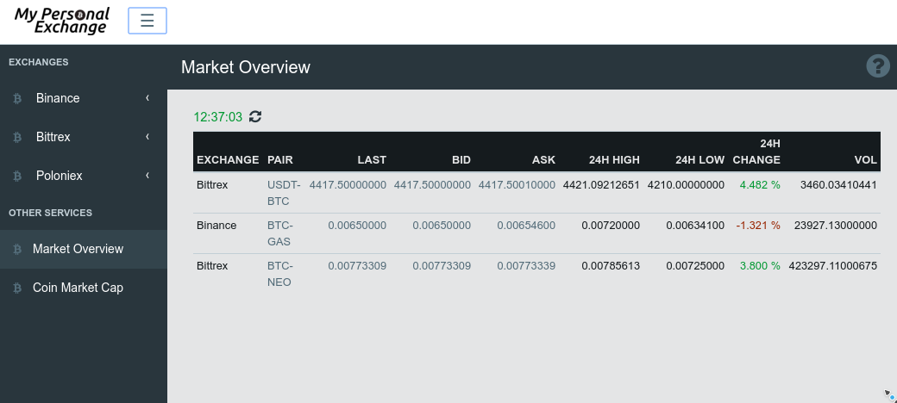
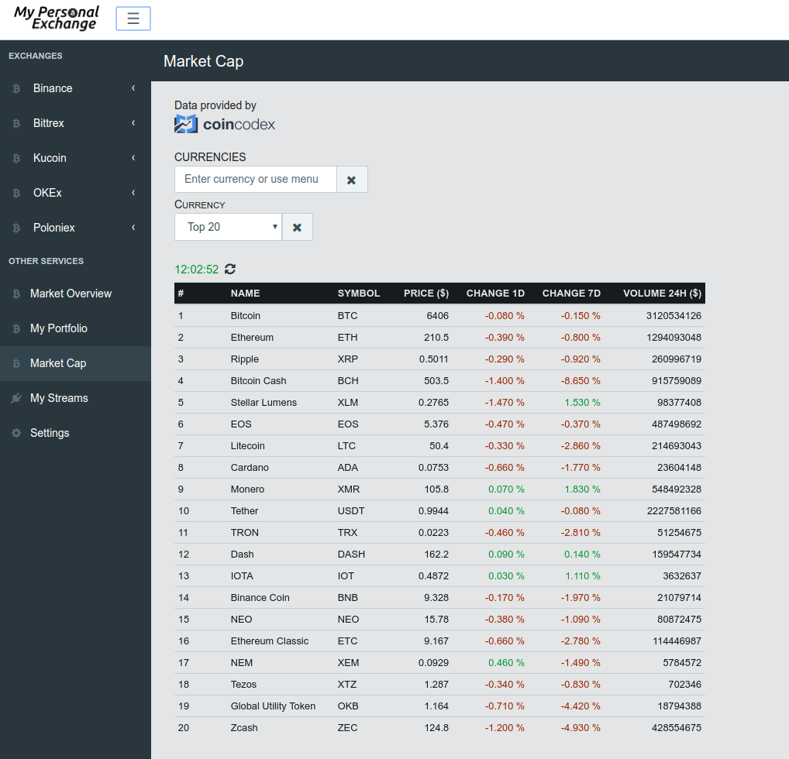
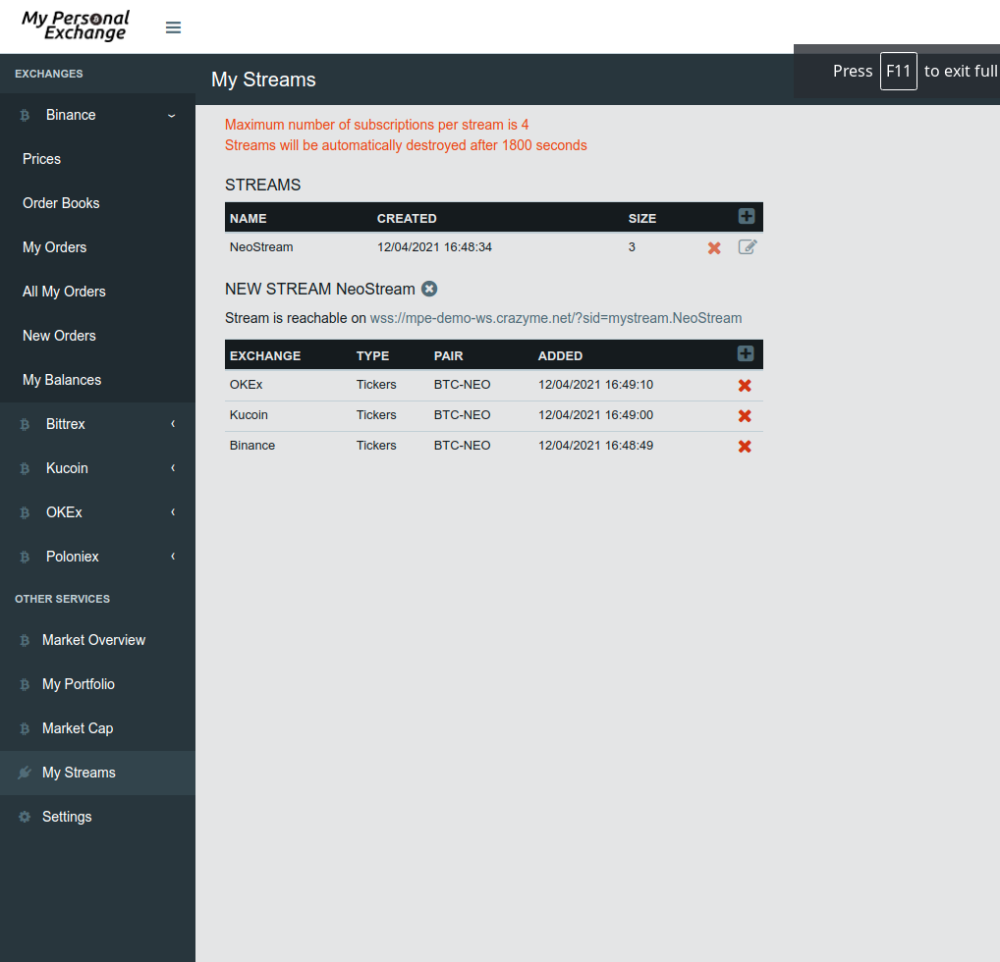
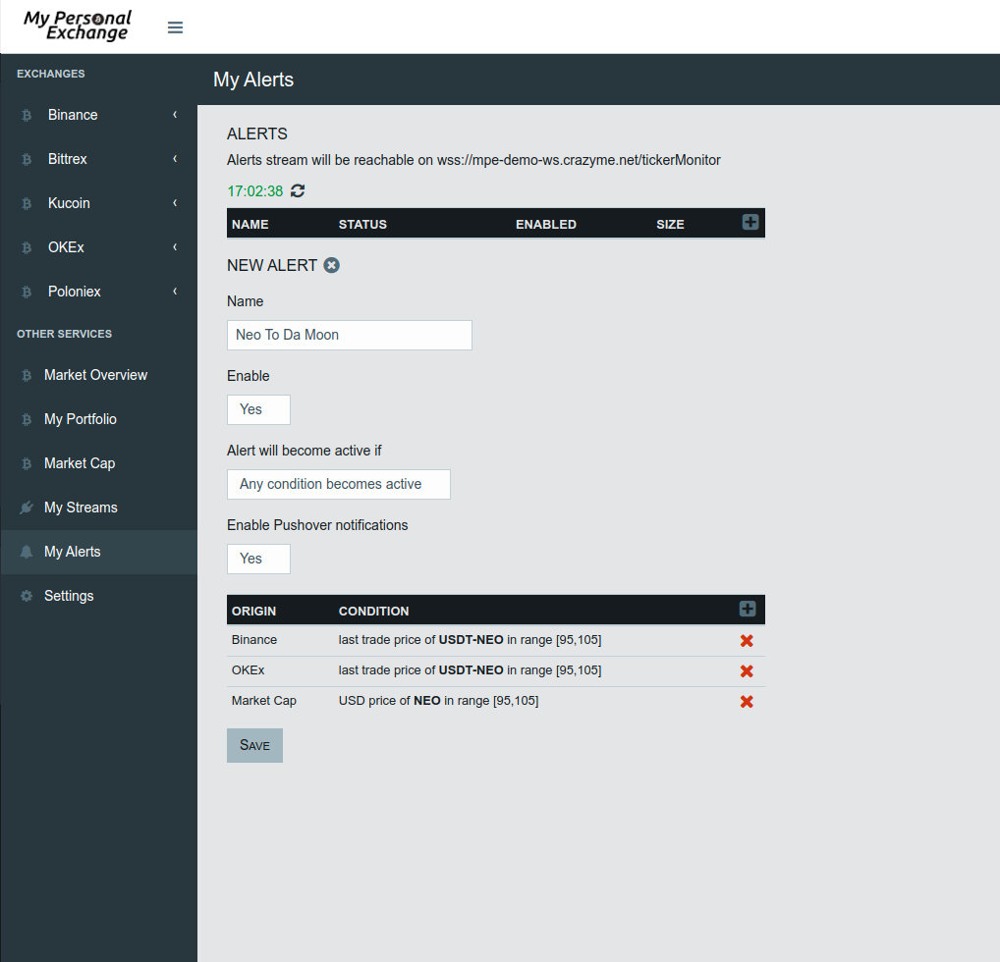

= User interface

== Presentation

User interface provides following access to :

* Prices with _TradingView_ graph when possible
* Order books
* Open/Completed orders
* Creation of new orders
* Balances
* Market Overview (an overview of all your favourite pairs)
* MarketCap (top 20 currencies)
* Custom WS streams creation
* Custom alerts creation

.Prices
[caption="",link=img/tickers.png]
image::img/tickers.png[Prices,400]

.Order Books
[caption="",link=img/orderBooks.png]


.My Orders
[caption="",link=img/orders.png]


.New Order
[caption="",link=img/newOrder.png]


.My Balances
[caption="",link=img/balances.png]
image::img/balances.png[My Balances,400]

.Market Overview
[caption="",link=img/marketOverview.png]


.MarketCap
[caption="",link=img/marketCap.png]


.My Streams
[caption="",link=img/myStreams.png]


.My Alerts
[caption="",link=img/myAlerts.png]


== Installation

[NOTE]
====
Following should be run in _ui_ subdirectory
====

=== Install dependencies

```
sudo npm install -g webpack && npm install
```

=== Build UI

```
npm run clean && npm run build
```

UI should then be available on http://127.0.0.1:8000/ui/ (assuming _gateway_ is running on _127.0.0.1:8000_)


== Dependencies

This project was made possible thanks to following projects :

* link:https://www.npmjs.com/package/axios[axios] for http requests
* link:https://www.npmjs.com/package/big.js[big.js]
* link:https://www.npmjs.com/package/bootstrap[bootstrap]
* link:https://www.npmjs.com/package/file-saver[file-saver] to export settings
* link:https://www.npmjs.com/package/font-awesome[font-awesome]
* link:https://www.npmjs.com/package/history[history]
* link:https://www.npmjs.com/package/react[react]
* link:https://www.npmjs.com/package/react-markdown[react-markdown] to display mardown help in the views
* link:https://www.npmjs.com/package/react-d3-basic[react-d3-basic] to build simple charts
* link:https://www.npmjs.com/package/react-router-dom[react-router-dom]
* link:https://www.npmjs.com/package/react-stockcharts[react-stockcharts] *THE AMAZING CHARTING LIBRARY*
* link:https://www.npmjs.com/package/reactstrap[reactstrap] React Components for Bootstrap 4
* link:https://www.npmjs.com/package/wolfy87-eventemitter[wolfy87-eventemitter] to dispatch events
