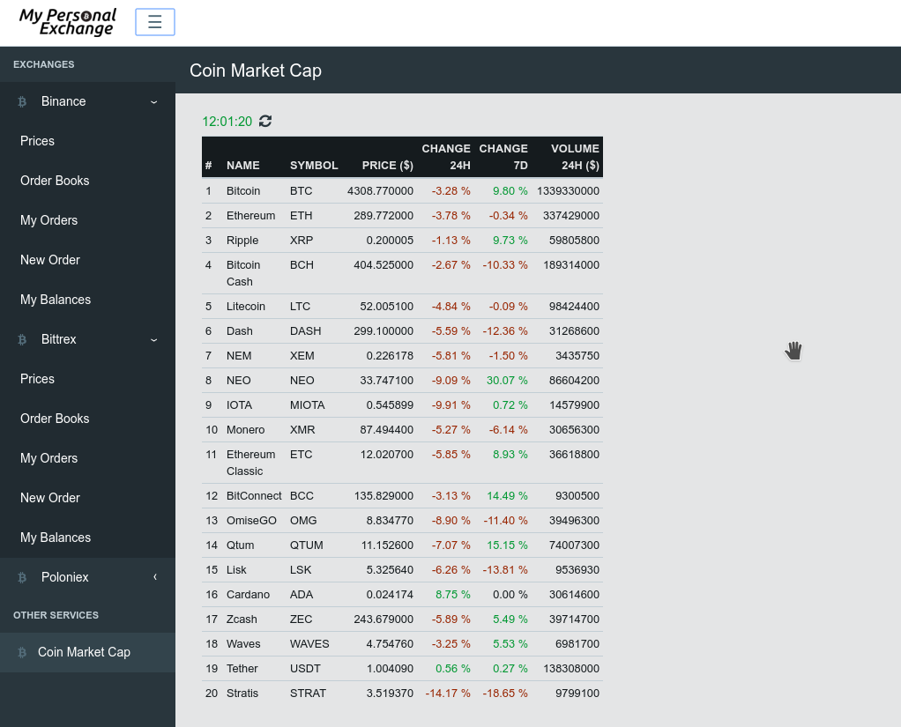

= User interface

== Presentation

User interface provides following access to :

* Prices with _TradingView_ graph when possible
* Order books
* Open/Completed orders
* Creation of new orders
* Balances
* Coin Market Cap (top 20 currencies)

.Prices
[caption="",link=img/tickers.png]
image::img/tickers.png[Prices,400]

.Order Books
[caption="",link=img/orderBooks.png]
image::img/orderBooks.png[Order Books,400]

.My Orders
[caption="",link=img/orders.png]
image::img/orders.png[My Orders,400]

.New Order
[caption="",link=img/newOrder.png]
image::img/newOrder.png[New Order,400]

.My Balances
[caption="",link=img/balances.png]
image::img/balances.png[My Balances,400]

.Coin Market Cap
[caption="",link=img/coinMarketCap.png]


== Installation

[NOTE]
====
Following should be run in _ui_ subdirectory
====

=== Install dependencies

```
sudo npm install -g webpack && npm install
```

=== Build UI

```
npm run clean && npm run build
```

UI should then be available on http://127.0.0.1:8000/ui/ (assuming _gateway_ is running on _127.0.0.1:8000_)
